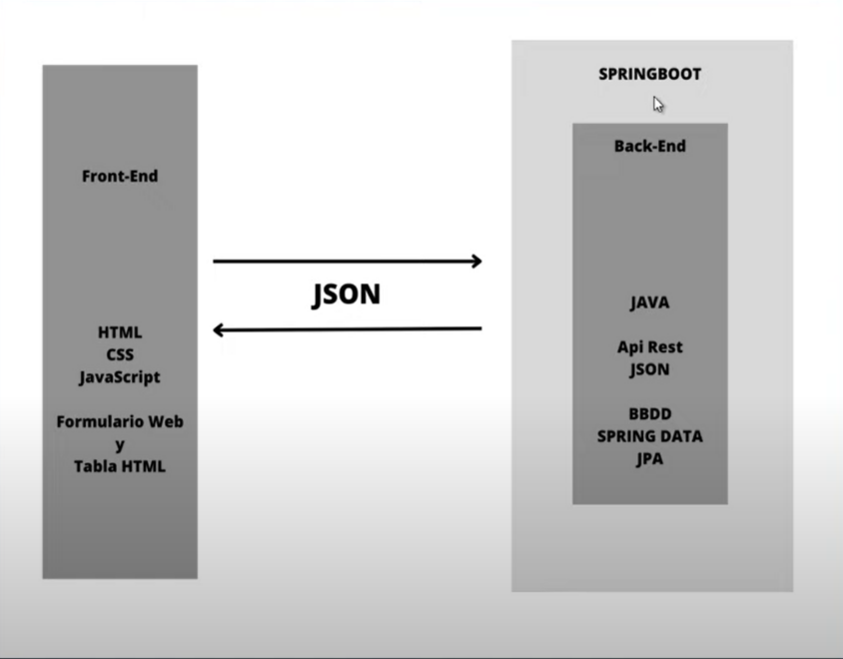

## rauliyo jajjajaja

### Backend (Carpeta Peliculas)

- **Lenguaje:** Java
- **Framework:** Spring Boot
- **IDE:** IntelliJ IDEA

**Endpoints del API REST:**

- `GET /api/peliculas`: Obtiene todas las películas.
- `GET /api/pelicula/{id}`: Obtiene una película por ID.
- `POST /api/peliculas`: Crea una nueva película.
- `PUT /api/peliculas`: Actualiza una película existente.
- `DELETE /api/pelicula/{id}`: Elimina una película.

### COSAS PENDIENTES

1. En este caso no hemos usado el enforque DDD porque no separaremos el código en entidades, repositorios, y servicios, facilitando  la mantenibilidad ,escalabilidad y centrandose en el servicio del dominio o logica del negocio.

